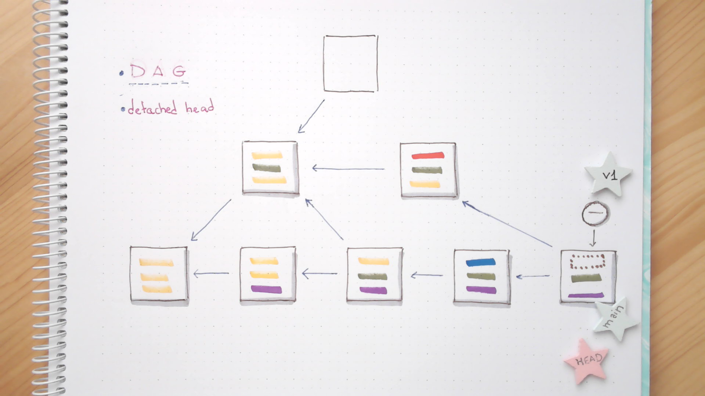

# Alice: tagging

## Lab

* Our writer decides that she doesn't need to keep enhancing the vocabulary of
the first chapter (at least for now), so she proceeds to delete the branch
 (`--decorate` is required to show the tags if the output is pipelined)

```bash
git log --graph --oneline --decorate \
  | grep "Replaced struggling and shore." -C 9999
git branch -d vocabulary-chapter-01
git branch
```

* After applying the `-d`, commits don't belong to *vocabulary-chapter-01*, as the
branch doesn't exists anymore:

```bash
git log --graph --oneline --decorate \
  | grep "Replaced struggling and shore." -C 9999
```

<details>
<summary>
Finally, Alice marks the commit pointed by *HEAD* as the first version of the book with a tag

```bash
git ███ v1
```
</summary>

---
#### Solution

```bash
git tag v1
```
---
</details>

* This fact is reflected in the log:

```bash
git log --oneline --graph --decorate \
  | grep v1 -C 9999
```

* And it is stored internally as another type of *ref*:

```
ls .git/refs/tags
```

* In fact, a simple tag is just a pointer to a commit:

```bash
cat .git/refs/tags/v1
cat .git/refs/heads/main  # points to the same object than the tag
```

<details>
<summary>
Ouch: Alice realizes that she used a **lightweight tag**, but she would like to set a comment. 
So she deletes the previously created tag:

```bash
git tag -█ v1
```
</summary>

---
#### Solution

```bash
git tag -d v1
```
---
</details>

* The tag reference has disappeared, and the directory is empty:

```bash
ls .git/refs/tags
```

<details>
<summary>
Alice wants to explain why this particular commit is important, and to be able
to append a comment to a tag, she needs to an *annotated* one. So whe will use
some extra flags with the `tag` command:

```bash
git tag -█ v1 -m "First chapter is ready to be reviewed!"
```
</summary>

---
#### Solution

```bash
git tag -a v1 -m "First chapter is ready to be reviewed!"
```
---
</details>

* The newly created tag is actually a full object in the repository, so the value
of the reference doesn't point to the HEAD commit anymore:

```bash
ls .git/refs/tags
cat .git/refs/heads/main
cat .git/refs/tags/v1      # the tag ref points to a tag object, so doesn't match the last commit
```

* Alice is very proud of her work, and closes the laptop to get some fresh air and inspiration

```bash
cd ../../
```

## Diagrams

