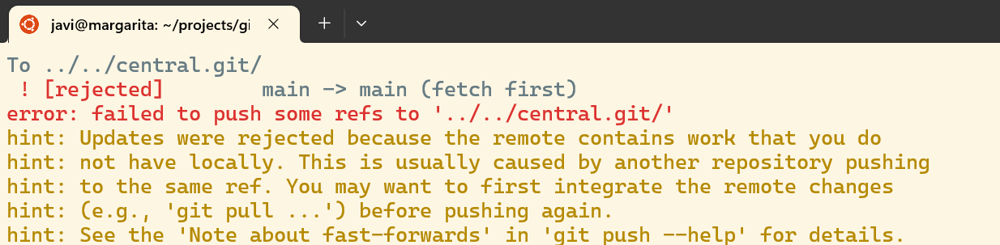
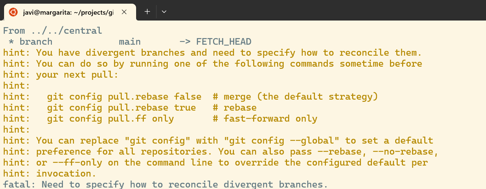
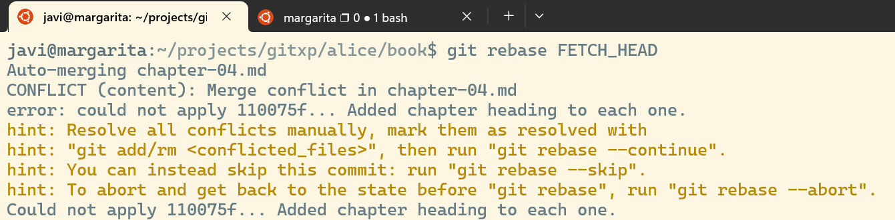
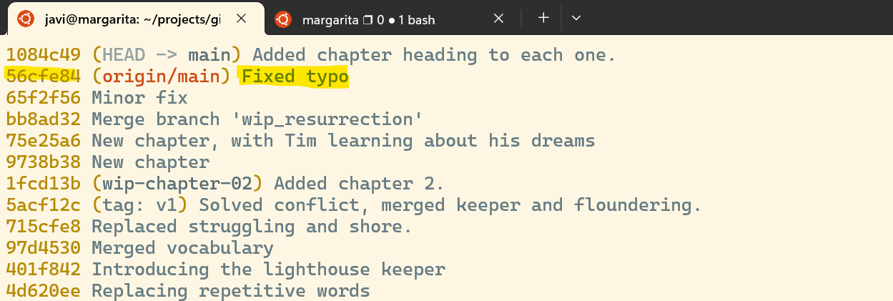

# Alice: history rewriting

In this laboratory, our best writer will make some changes, but simplifying
the log before merging her working branch with `main` to avoid generating noise.

## Concepts and commands

- [x] History clarity
- [x] `--amend`
- [x] `rebase -i`
- [x] `rebase`

## Lab: ammend

* She starts by reaching her working area

```bash
cd
cd alice/book
```

* Alice just realizes they forgot to name the different chapters. It is going
to take some work to solve it, so she creates a new branch

```bash
git checkout -b feat_headings
```

* Now she will start updating the different chapters, starting with the first
one:

```bash
ed chapter-01.md << EOF
2i

## Chapter one
.
w
q
EOF

cat chapter-01.md
```

* Time to update the repo:

```bash
git add chapter-01.md
git commit -m "Updated chapter"
```

* Umh... looking at the project history, Alice is not very proud of her last commit message

```bash
git log --oneline
```

* So she is going to replace the message by replacing the old `commit` with a new one

```bash
git commit --amend -m "Added chapter number (1)"
```

* Now it looks much better:

```bash
git log --oneline
```

## Lab: interactive rebase

* So she continues with the rest of the chapters

```bash
sed -i '1s/^/## Chapter two\n\n/' chapter-02.md
cat chapter-02.md
git add chapter-02.md
git commit -m "Added chapter number (2)"

sed -i '1s/^/## Chapter three\n\n/' chapter-03.md
cat chapter-03.md
git add chapter-03.md
git commit -m "Added chapter number (3)"

sed -i '1s/^/## Chapter four\n\n/' chapter-04.md
cat chapter-04.md
git add chapter-04.md
git commit -m "Added chapter number (4)"
```

* Cool. Time to merge the changes. But Alice thinks the different log messages
are mostly noise, that could be simplified. So she rewrites the lasts four commits
into a single one

```bash
git rebase -i HEAD~4
```

* After this command, the default text editor shows one line with each of the last
four commits. Alice could change the order of the commits by moving those lines,
for example. By default, the command applied to each commit will be `pick`, that
would keep the commit in the log.


* Alice chooses to `squish` (flatten) the last three commits into the first one by
editing the first column of those commits as pictured here:


* By pressing `ctrl+x` plus `y`, our writer indicates that she is ready to save the
list of changes. `git` shows the comments assigned to the collapsed commits, and
Alice replaces them with an explanation of what has happened during all of them:


* Something like *"Adding chapter heading to each one"* should be good enough
to summarize what has happened, so she types it and then presses again
`ctrl+x` plus `y`.


* The new log entry is much more interesting, as it explains what has happened
without providing irrelevant details

```bash
git log --oneline --graph
```

* Now everything is ready to be merged

```bash
git checkout main
git merge feat_headings
```

## Lab: rebase between branches

---
### Warning

**REWRITING PUBLISHED BRANCHES IS CONSIDERED A VERY RUDE PRACTICE, AS IT CAN
POTENTIALLY MESS UP THE COMMITS OF PULLING REPOSITORIES. AVOID IT UNLESS
YOU REALLY UNDERSTAND WHAT IS THE GLOBAL SITUATION OF THE PROJECT.**
---

* Almost there! One `push` command and the job will be completed... but something
is wrong

```bash
git push origin main
```



* Alice understands that there is some content in the remote branch that is ahead
of his current commit, so she needs to `pull` it... but, again, the answer is odd

```bash
git pull origin main
```



* Ok, so it was impossible to merge because the remote `main` branch has
changes that happened before new commits where added to the local one, and
*git* wants to know what to do. First, let's learn more about those changes,
using the short-lived `FETCH_HEAD` reference

```bash
git show FETCH_HEAD 

git log FETCH_HEAD --oneline
```

* Alice understand that Bob has fixed a typo, probably created by her. And it would
be nice if they can keep that comment in place, instead of replacing it with a new
commit (as it would happen if she applies a classic `merge`)

```bash
git rebase FETCH_HEAD
```

* Oh, another error, of course. There are always errors. But, in this case, Alice
is very familiar with it:



* She just needs to edit the fourth chapter to both keep the typo correction and
the title on it:

```bash
L0=$(grep -n "<<<<<<<" chapter-04.md | cut -f1 -d:)
LF=$(grep -n ">>>>>>>" chapter-04.md | cut -f1 -d:)

echo Replacing from $L0 to $LF.

ed chapter-04.md << EOF
${L0},${LF}d
1i
## Chapter four

Tim couldn't keep the curiosity at bay any longer. The dreams of the menacing mermaids haunting him each night had become unbearable. He found himself standing outside the old man's home, his heart pounding with anticipation. It was time to seek answers from the man who seemed to hold the key to the mysteries of the sea.
.
w
q
EOF
```

* She now will check if everything is in place:

```bash
cat chapter-04.md \
  | grep "the old man's home" -C 999
```

* Cool! Next step, follow the advice from the last `git` command output and `add`
the current version of the file

```bash
git add chapter-04.md
```

* And she is ready to continue with the `rebase` operation 

```bash
git rebase --continue -m "Added chapter heading to each file"
```

* Yes! No more problems here! All files have their title, the typo is not there anymore
and the history of the project has all the relevant information (including the typo 
correction commit in the corresponding position of the log)

```bash
git log --oneline
```



* She is very confident now on her ability to make a successful `push` to the central repo

```bash
git push origin main
```

* Big success! It was not as easy as she had though, but here she is. Now she
can take a break

```bash
cd ../..
```