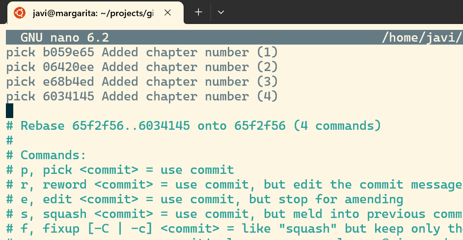
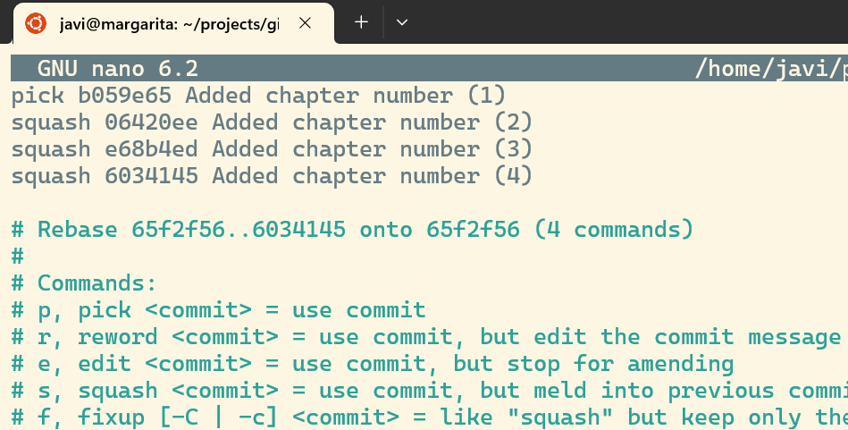
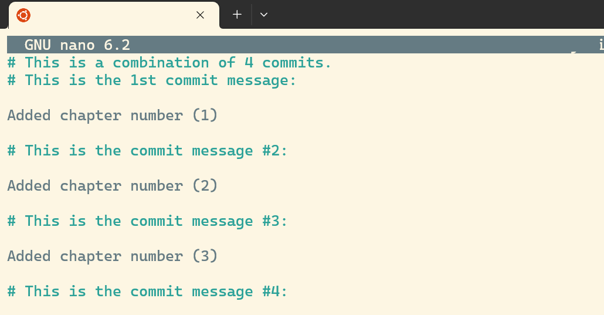
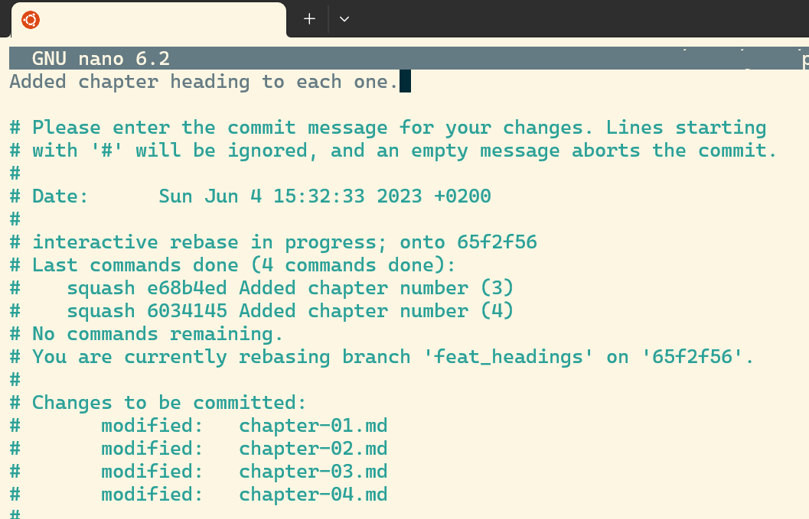

# Alice: history simplification

In this laboratory, our best writer will make some changes, but simplifying
the log before merging her working branch with `main` to avoid generating noise.

## Lab

* Alice updated the title of the first chapter, but after taking some time for
drinking coffee, she prefers to ensure she is in the correct directory:

```bash
cd
cd alice/book
git status
git log --oneline
```

* Everything looks fine, so she continues editing the rest of the chapters

```bash
sed -i '1s/^/## Chapter two\n\n/' chapter-02.md
cat chapter-02.md
git add chapter-02.md
git commit -m "Added chapter number (2)"

sed -i '1s/^/## Chapter three\n\n/' chapter-03.md
cat chapter-03.md
git add chapter-03.md
git commit -m "Added chapter number (3)"

sed -i '1s/^/## Chapter four\n\n/' chapter-04.md
cat chapter-04.md
git add chapter-04.md
git commit -m "Added chapter number (4)"
```

* Cool. Time to merge the changes with *main*. But Alice thinks the different log messages
are mostly noise, that could be simplified. So she rewrites the lasts four commits
into a single one by using an interactive `rebase`

```bash
git rebase -i HEAD~4
```

* After this command, the default text editor shows one line with each of the last
four commits. Alice could change the order of the commits by moving those lines,
for example. By default, the command applied to each commit will be `pick`, that
would keep the commit in the log.



* Alice chooses to `squish` (flatten) the last three commits into the first one by
editing the first column of those commits as pictured here:



* By pressing `ctrl+x` plus `y`, our writer indicates that she is ready to save the
list of changes. `git` shows the comments assigned to the collapsed commits, and
Alice replaces them with an explanation of what has happened during all of them:



* Something like *"Adding chapter heading to each one"* should be good enough
to summarize what has happened, so she types it and then presses again
`ctrl+x` plus `y`.



* The new log entry is much more interesting, as it explains what has happened
without providing irrelevant details

```bash
git log --oneline --graph
```

* Now everything is ready to be merged

```bash
git checkout main
git merge feat_headings
```

