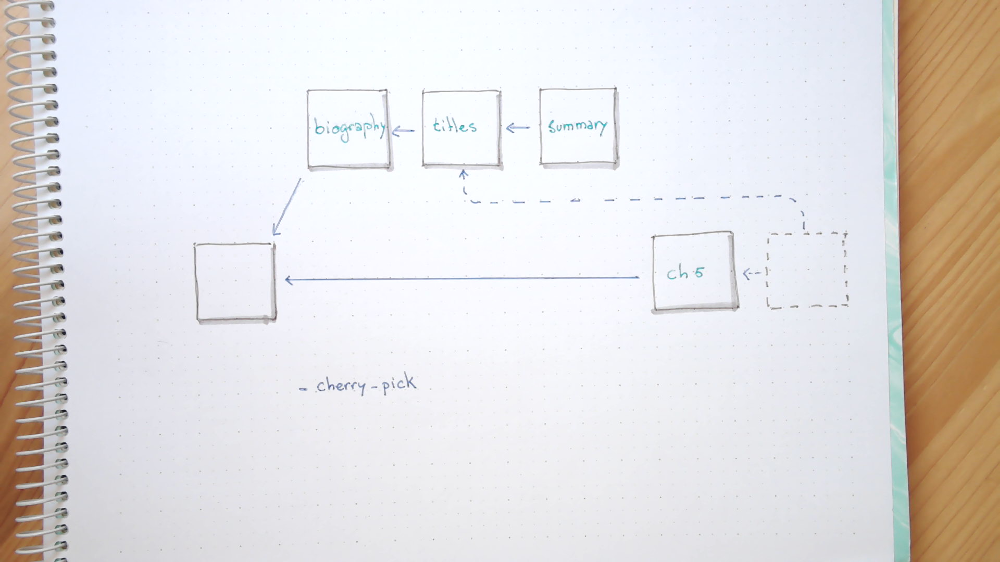

# Alice: cherry picking changesets

During this lab, Alice will work on two different features at the same time in separated
branches. She will realize that there is a change implemented in one of those branches
that would be nice to have in the other one, so she will integrate only that particular
update.

## Lab

* Alice selects her working area

```bash
cd
cd alice/book
git status
```

* And creates the new branch in which will add metadata content, like the biography of the authors 
of the book

```bash
git checkout -b feat-meta

cat << EOF > about-authors.md
## Biography

Alice is a software developer with a deep love for writing and literature. When she's not immersed in coding, you can find her sailing the open waters, drawing inspiration from the vastness of the ocean for her imaginative stories that explore the fusion of technology and humanity.

Bob is a skilled developer and aspiring author, blending his programming prowess with imaginative storytelling. He finds solace in both coding and sailing, where the rhythmic waves inspire his fiction, delving into the intricate connections between technology, the human psyche, and the vast mysteries of the ocean.
EOF
```

* She checks that everything is in place and commits the file

```bash 
ls

git add about-authors.md
git commit -m "Created first draft of the authors biography."
```

* Also, the book of styles of the editor encourage the use of numbers instead of letters
in the chapter title

```bash 
sed -i "s/Chapter one/Chapter 1/" chapter-01.md 
sed -i "s/Chapter two/Chapter 2/" chapter-02.md 
sed -i "s/Chapter three/Chapter 3/" chapter-03.md 
sed -i "s/Chapter four/Chapter 4/" chapter-04.md 

git add chapter*.md
git commit -m "Updated titles to figures"
```

* Finally, it is time to write a short summary of the story now that it is taking shape

```bash 
cat << EOF > summary.md
## Summary

Tim's story follows a young person who has always been captivated by the ocean. During a fateful encounter while swimming, Tim is saved from a dangerous current by a mysterious lighthouse keeper named John. As they connect, Tim discovers John's own enigmatic experiences with the sea's secrets, leading him to question the meaning behind his haunting nightmares of malevolent mermaids. Drawn by a sense of wonder and curiosity, Tim sets out on a journey to understand the mysteries of the ocean and the potential connection he shares with it. The story explores the mystical allure of the sea, unraveling the depths of imagination and reality.
EOF

git add summary.md
git commit -m "First draft of the summary"
```

* Ok, good work. But Alice doesn't want to stagnate the development of the book, so
she changes to the main branch to write additional content

```bash
git switch main

ls
```

* The next chapter is important, as it introduces the second protagonist of the book

```bash
cat << EOF >> chapter-05.md
## Chapter 5

In the depths of the shimmering sea, a young mermaid found herself plagued by haunting dreams of a young person. In her slumber, vivid visions of him swimming above the waves filled her mind. She marveled at his interaction with the ocean, wondering why he seemed so drawn to its vast expanse.

As she swam through the ocean's depths, her dreams of the young person became a guiding light, urging her toward a future that held both wonder and uncertainty. She embraced the journey, ready to discover the true meaning behind their shared dreams.
EOF
```

* Good. Time to update the repo

```bash
git add chapter-05.md
git commit -m "Introduction of the mermaid protagonist"
```

* Umh... now she realizes that there is an inconsistency there:

```bash
cat chapter*.md | grep Chapter
```

* Clearly, she would like to repeat the same **change** that applied in the other branch. To
do so, she starts by finding the commit that implemented the change set

```bash
git log feat-meta --oneline
```

* Located: it is the one that contains the message "*Updated titles to figures*". Alice knows
that is possible to use the commit message instead of the commit id in many places:

```bash
git show --quiet ":/figures" 

git show ":/figures" -- chapter-01.md
```

<details>
<summary>
So she takes advantage of that feature to extract the *changeset* from that particular
commit and apply it again against `HEAD` (commits don't know about branches, so there is no
need to further specify that detail)

```bash
git ██████-pick ":/figures"
```
</summary>

#### Solution

```bash
git cherry-pick ":/figures"
```
---
</details>

* Good! Time to see what is the status of the working area

```bash
git status
git log --oneline --graph
```

* And to check that we applied the same style to all the titles in the book

```bash
cat chapter*.md | grep Chapter
```

## Diagrams

